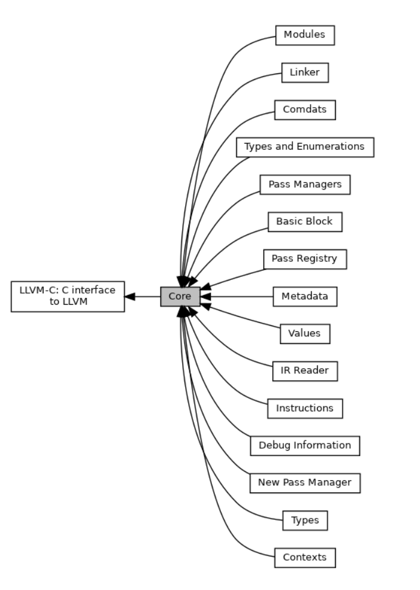

[TOC]

Trying to ~~guess~~ learn how the llvm IR(core) works

[llvm document (internal)](https://llvm.org/doxygen/)

### How to read the llvm document ?

Check the core part of the llvm, ~~and then imitate it~~.



### Hierarchy

- `module` : the whole program
- `function ` : contains `basic block`
- `basic block` : contains `instruction`, need to be labeled
- `instruction`

### Blocks and CFG design

just imitate the design of llvm, that is, look at `.ll` file to find out the solution

##### `if` statement

Upon encountering `if` statement, then end the current block, and create `ifthen`,`ifelse` block.

After the `ifthen` and `ifelse` block, create an `afterif` block. The `afterif` block continue to execute the code after `if` statement.

##### `while` statement

- jump to `whilecond` block
- `whilecond` block
    - if condition is true, jump to `whilebody` block
    - if condition is false, jump to `afterwhile` block

##### `for` statement

- execute the initial statements first, and then jump to `forcond` block
- `forcond` block
    - if condition is true, jump to `forbody` block
    - if condition is false, jump to `afterfor` block
- `forbody` block : execution done, jump to `forstep` block
- `forstep` block : jump to `forcond` block

##### `break` statement

jump to `afterwhile` or `afterfor` block

##### `continue` statement

jump to `whilecond` or `forstep` block

### SSA(Static Single Assignment)

Eevery virtual register can only be assigned once.

**Every mutable variable is in memory**, register is only used to pass value.

### Scope design (to find the corresponding value)

I have designed the `scope` system in semantic phase.

- local scope : s stack-like to maintain the variables.
- global scope : global variables, functions, classes

just catch the corresponding id in scopes.
  - memory load first
  - pass value by register
### Some implementation details

Showing some llvm instructions for example

- `new`
    ```llvm
    %1 = alloca i32*, align 8
    %2 = call noalias i8* @malloc(i64 40) #2
    %3 = bitcast i8* %2 to i32*
    store i32* %3, i32** %1, align 8
    ```
- `assign`
    ```c
	int b;
	b = 10;
	b = 20;
    ```

    use `store` to assign value to a variable

    ```llvm
    %1 = alloca i32, align 4
    store i32 10, i32* %1, align 4
    store i32 20, i32* %1, align 4
    ```
- `subscript`
    ```c
    int fn(){
	    int a[10];
	    int b = a[2];
	    return 0;
    }
    ```
    ```llvm
    define dso_local i32 @fn() #0 {
    ; allocate space for array %1
      %1 = alloca [10 x i32], align 16
    ; allocate space for variable %2
      %2 = alloca i32, align 4
    ; get address of 2th element of array %1
      %3 = getelementptr inbounds [10 x i32], [10 x i32]* %1, i64 0, i64 2
    ; get value inside address %3 and put it into a virtual register %4
      %4 = load i32, i32* %3, align 8
    ; store value %4 into variable %2
      store i32 %4, i32* %2, align 4
      ret i32 0
    }
    ```
    Noticing that to pass the value from a variable to another, **we need to use a register as an intermediate**.
- `member function`
    parameter : the class type
    ```llvm
        define linkonce_odr dso_local i32 @_ZN1A6getsumEv(%struct.A* %0) local_unnamed_addr #2 comdat align 2 {
          %2 = getelementptr inbounds %struct.A, %struct.A* %0, i64 0, i32 0
          %3 = load i32, i32* %2, align 4, !tbaa !2
          %4 = getelementptr inbounds %struct.A, %struct.A* %0, i64 0, i32 1
          %5 = load i32, i32* %4, align 4, !tbaa !7
          %6 = add nsw i32 %5, %3
          ret i32 %6
        }
    ```
- `member variable`
    ```llvm
    %1 = alloca %struct.A, align 4
    %2 = alloca i32, align 4
    %3 = getelementptr inbounds %struct.A, %struct.A* %1, i32 0, i32 1
    %4 = load i32, i32* %3, align 4
    store i32 %4, i32* %2, align 4
    ```
    Also follow the principle of **passing value by register**.
