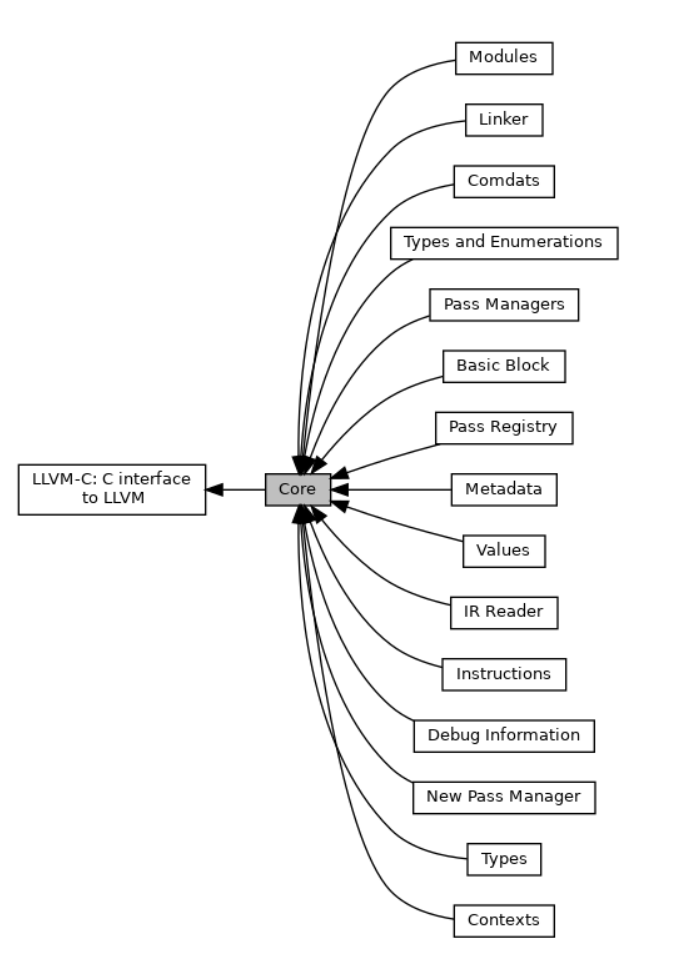

[TOC]

Trying to ~~guess~~ learn how the llvm IR works

[llvm document (internal)](https://llvm.org/doxygen/)

### How to read the llvm document ?

Check the core part of the llvm, ~~and then imitate it~~.



### Hierarchy

- `module` : the whole program
- `function ` : contains `basic block`
- `basic block` : contains `instruction`, need to be labeled
- `instruction`

### Blocks and CFG design

just imitate the design of llvm, that is, look at `.ll` file to find out the solution

##### if statement

`then` block, `else` block, `after` block

`condition` is in the block before if statement.

##### while statement and for statement is similar

`condition` should be a separate block, as it may be entered from `continue`.

##### tail block design

we can find that the `before` block and `after` block are like the entry and exit of `if`/`while`/`for` statement.

```cpp
if(a == b){ // if1
  if(b == c){ // if2
  }
  if(c == d){ // if3
  }
}
```

To implement the above code, we need to link `if3`'s `after` block to `if1`'s `after` block, but we can't find `if3`'s `after` block. So we need set a `tail` block for every block.

For example, `if1then`'s `tail` block is `if3after`, we can find it recursively.

### SSA

Eevery virtual register can only be assigned once.

**Every mutable variable is in memory**, register is only used to pass value.

For some special reason, llvm-ir uses the SSA form. After mem2reg pass, all allocas are removed, so there will be many `phi` instructions.

### Scope design (to find the corresponding value)

I have designed the `scope` system in semantic phase.

- local scope : s stack-like to maintain the variables.
- global scope : global variables, functions, classes

How to catch the corresponding value ?

Set an llvm-value in every `ASTnode` and every `variable registry`.

- an ASTnode has `addr` and `value`, sometimes we just need the `addr`.
- `registry`'s value is always a address.
- if `registry` is a member variable, the value is a const int representing it's id in the class.
- ASTfunction has IRfunction type

### parameter

function's formal argument is set as a special `parameter` type in llvm type system, and in llvm document, it is called `argument`.

### value system

Almost everything in llvm is a value. A value can be used by another value(user).

### type system

Every value has a type.

- For a function, we record the return type and the parameter types.
- For a instruction, we record the type of the result.

A store instruction have no result, so it's type is `void`.


### value's name

a value can be used as oprand must have a name.

- global's name is it's own name
- local's name should be renamed.

### IRPrinter

- a type can be printed.
- a value can be def and used.
  - def : print the name and in special format
  - use : just use the name