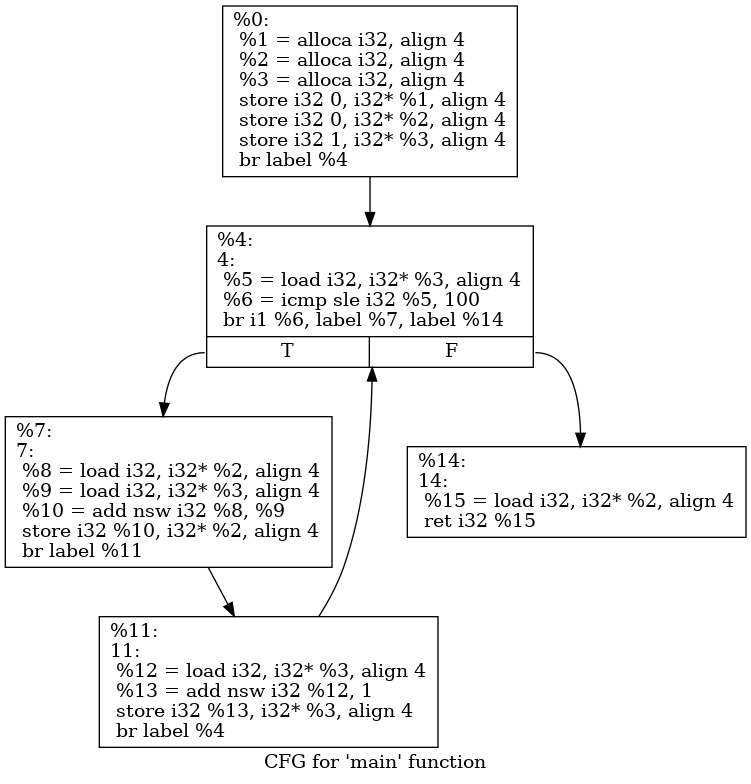

### Commands
compile
`clang test.c -o test`

AST
`clang -Xclang -ast-dump -fsyntax-only test.c`

Human readable IR
`clang -S -emit-llvm test.c`

`.ll` file can be compiled to executable file

```sh
clang main.ll -o main
./main
```

bitcode IR
`llvm-as test.ll`

O3 optimization
`opt test.ll -S -O3`
`clang -S -emit-llvm -O3 test.c`

### 数据表示

数据存储在: 栈、寄存器、数据区

全局变量`@`
```llvm
@global_varible = global i32 0
```

栈上的变量`%`
```llvm
;register
%local_varible = add i32 1, 2

;stack
%local_varible = alloca i32
```

虚拟寄存器是个好东西

##### 寄存器分配

`calling-saved register`
`called-saved register` 

### SSA(static single assignment)

变量不能被赋值两次 $\implies$ 存储在全局变量或或者栈上

### 所有的变量都是指针

`@global_var` 和 `@local_var` 都是存储的地址。

操作的时候需要`i32* @global_var` 和 `i32* @local_var` 这样类似，前面的`i32*`表示`@global_var`是一个指针，指向一个`i32`类型的数据。

##### 结构体和指针

`getelementptr` 操作栈上和全局的结构体

`extractvalue` `insertvalue` 操作寄存器类型的结构体 ~~（真够抽象的）~~。

### 控制语句

- 条件跳转
- 无条件跳转
- 标签
- 比较指令

##### basic block contains 

- 开头标签
- 指令
- 结尾指令：也是跳转`br`?

##### 可视化工具

```sh
opt -dot-cfg test.ll
dot .main.dot -Tpng -o main.png
eog main.png
```
**效果**



***
