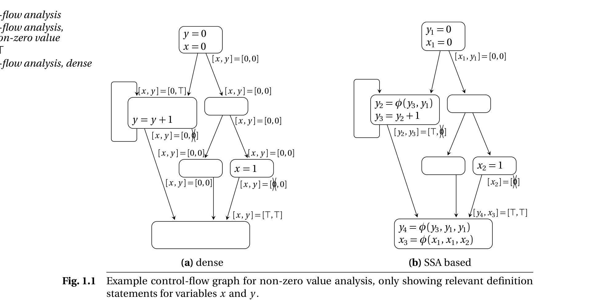
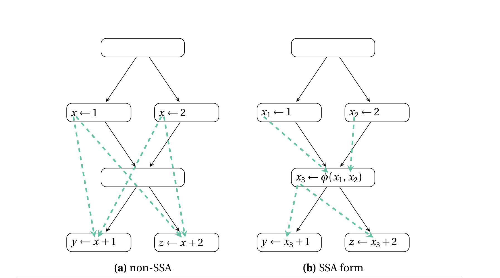
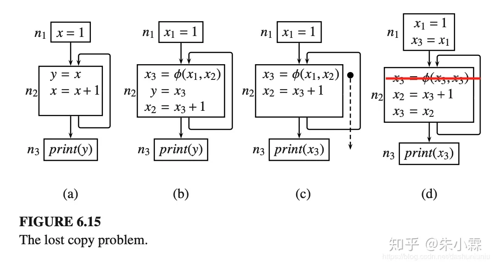
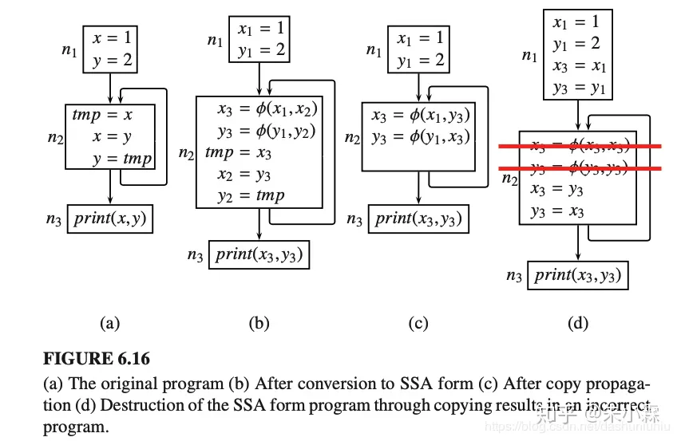
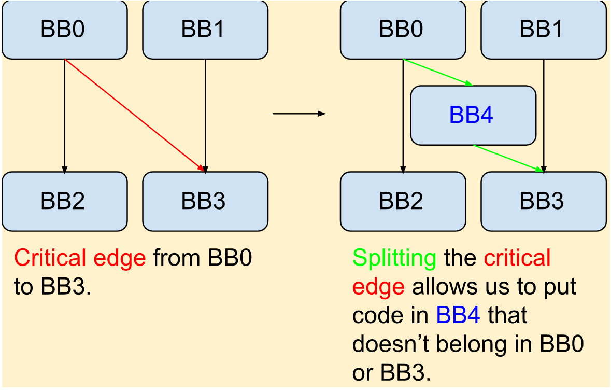

### Data flow for analysis

> Data-flow analysis collects information about the program at compile time in order to make optimizing code transformations.
##### 到达定值

数据流分析是为了探究某条语句中使用的值会从哪里来

- unambiguous definition 明确的定值
不存在不确定的赋值，所有的def都是确定的
- ambiguous definition 模糊定值
调用一个函数（过程），这个函数有时修改变量t，有时不修改。

##### Back edge of Data flow

- 没有phi时，所有的use必定会被用到，所以不可能出现def-use的环。
- **$\rho$形**：有phi时，phi中的某个分支天然不会在没有def的情况下用到（这里指程序运行过程中的动态def，而不是代码中的静态def），于是可能会出现环，此处恰好由于不会def，相当于破环成链。

```
x1 = 0
-------------
x2 = phi(x1, x3)
x3 = x2 + 1
```

### SSA 和 $\phi$ 

> A procedure is in SSA form if every variable is defined only once, and every use of a variable refers to exactly one definition.

- **Static** Single Assignment 并不阻值一个变量在运行的时候被多次赋值，而是保证只会在一条指令中被赋值，这和DSA (**Daynamic** Single Assignment)是不同的。

这个**明确定值**和**静态单赋值**是否相同？

- 没有phi也没有SSA的情况下，一个use的来源可能有多个def。
- 在有phi且保证了SSA情况下，phi将所有可能的def整合到了一起，且phi本身也是一个单独的def，所以是单赋值的。

##### A simple example

在有SSA form的IR上做data flow analysis ：non-zero variable analysis



> The results of SSA data flow analysis are more succinct. In the example, there are fewer data-flow facts associated with the sparse analysis than with the dense(classical) analysis.

##### Def-use and use-def chains

Without and with SSA, there is the single reaching-definition property.



##### Pruned SSA

看起来和phi elimination差不多。

##### conventional SSA and transformed SSA

- CSSA 具有phi related 变量的 liveness不相交的特点。
- TSSA 则没有

### mem2reg

fake ssa (alloca/load/store)

##### Minimal property & Strict SSA & Dominance property

- **Minimal property** : insert the minimal number of phi nodes to preserve the SSA property.

- **Strict SSA** : Every variable is defined before it is used along every path from the entry to the exit point.

- **Dominance property** : Every variable is dominated by its definition.

Our IR is strict, and we want to transform it into SSA, then strictness is equivalent to dominance property. Notice that we use the dominance frontier to compute minimal SSA.

##### Dominance Relation

- block $n_1$  **dominates** $n_2$ if every path in the CFG from the entry point to $n_2$ includes $n_1$.

- **strictly dominates** if $n_1$ dominates $n_2$ and $n_1 \neq n_2$.

- **pseudo-definition** at the entry point. Alloca ensures that the variable is defined at the entry point (?).

- **immediate dominator** of $n_2$ is the unique block $n_1$ such that $n_1$ dominates $n_2$ and $n_1$ does not dominate any other block that dominates $n_2$.

- **dominance frontier** : $n_1$ doesn't dominate $n_2$ but $n_1$ dominates one of $n_2$'s predecessors.

##### Joint blocks of a Set

- 通过支配树（在第一个节点默认有def）的迭代支配边界来确定一个alloca 的join node（经过多个def的use点）
- 在joint node处添加phi，phi的oprand暂时为空。

##### Rename

- 重命名：按照支配树（dfs）的顺序（因为要确定原来的alloca的load是从哪里store过来的，从phi or 从别的store），遍历每一个块。
  - 遍历块的时候确定每个alloca在这个块的末尾的def。
  - 确定了def之后给这个块的succ的phi添加oprand。（也可以最后再统一添加）

### SSA related optimization

~~The following optimizations are generated by copilot!!!~~

##### Dead Code Elimination

##### Constant Propagation

##### Copy Propagation

##### Common Subexpression Elimination

##### Loop Invariant Code Motion

##### Loop Unrolling

##### Loop Strength Reduction

### Phi elimination

##### Back edge problem

什么时候会出现back edge problem？

- 高维数组的申请，直接用phi合并init和step的指针，会出现环
- 循环有goto，在做了phi elimination后会出现环（大概）

##### 需要注意的问题
- Phi 只能定义在每个block的开头，并且所有phi是并行赋值的。
- 并行赋值需要注意swap problem
- 直接move到phi def的变量处会出现lost copy problem

##### lost copy problem



对于phi这个选择过程的赋值应该是要在basic block之间的edge 中进行的，但是这里直接在上一个块的末尾进行了选择过程，可能这个过程本身就不应该执行。

##### swap problem



本来$\phi$的赋值应该是并行的，但是swap problem显然会变成串行的。
##### Why split critical edge ?

split critical edge 就是为了把新加的指令放到edge上面，而不是放到前驱块或者后继块上。这样可以避免lost copy problem。



##### 如何 eliminate phi

- 做完所有的path之后split critical edge
- 对于可能出现swap problem的地方，对于eliminate 产生的move指令进行拓扑排序后破环，每一个环新加一个临时变量后按照反拓扑序列进行赋值。

- 也可以直接对于每一个phi新开一个新的临时变量作为中间变量，这样可以直接解决swap problem 和 lost copy problem。

### calling convention
- 一个由caller保存（到栈上），一个由callee保存（到栈上），用法比较直观。
- 理论上来说，所有的寄存器都可以当做caller save 或者 callee save。
- 为了平衡内存的开销，caller 和 callee需要分工，这就是calling convention
- 寄存器分配时候的caller 和 callee的分工
  - 考虑变量的生命周期，是否是临时变量
  - 是否跨越调用过程依然活跃，如果是，就是callee save

### 图染色

##### 图染色的 calling convention
- call 指令会用到argument register ($a_x$)， 这是use
- 跨越call依然活跃的变量，希望全部是callee save，所以call指令会def所有的caller save（和跨越的变量冲突）
- 每个函数的开头存下callee save register，函数结束的时候恢复，用 move 的方式来copy到一个新的虚拟寄存器，不用做栈分配。
  **TO THINK :**
  - 多用move到虚拟寄存器的思想，反正后面看情况溢出到栈上。
  - 虚拟栈空间分配的思想(现在用的stackOffset)和寄存器结构改变(统一的结构，rd，rs1，rs2)

##### 变量的活跃性

$$
\begin{aligned}
\text{in}(n) &= \text{use}(n) \cup (\text{out}(n) - \text{def}(n))\\
\text{out}(n) &= \bigcup_{s \in \text{succ}(n)} \text{in}(s)
\end{aligned}
$$

按照虎书图染色就好。